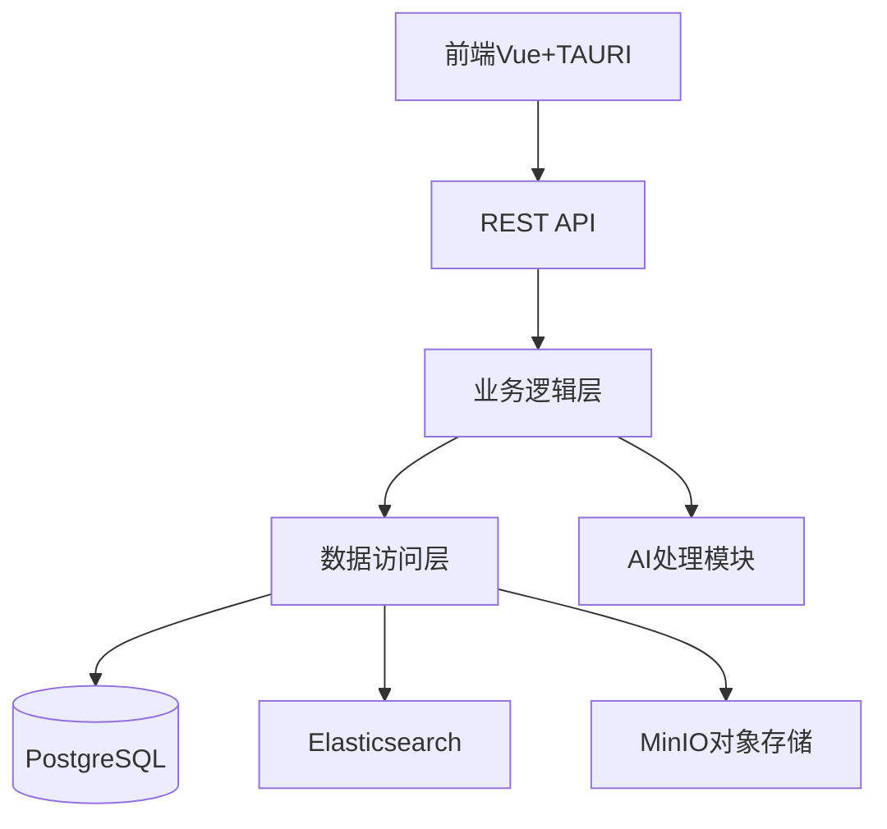
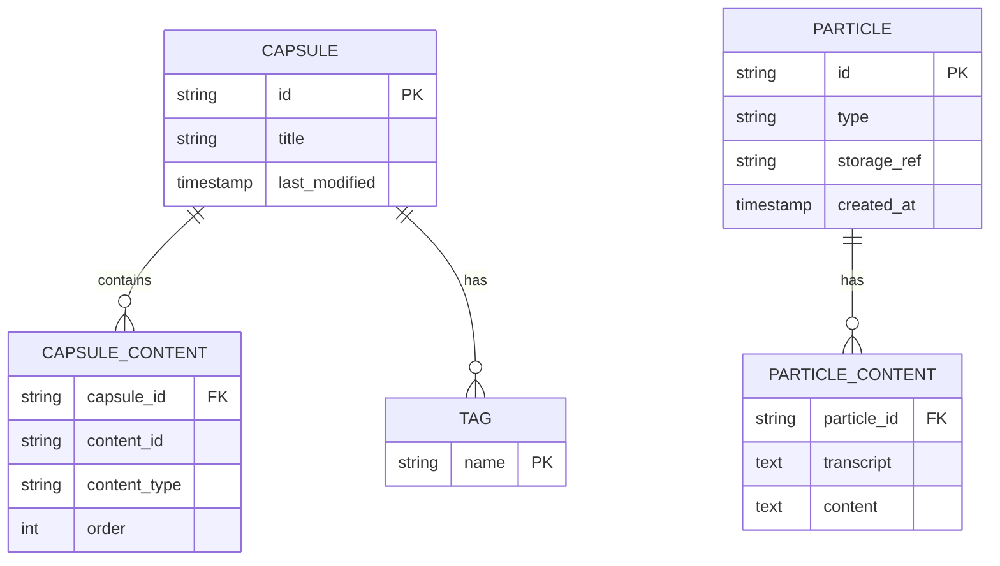
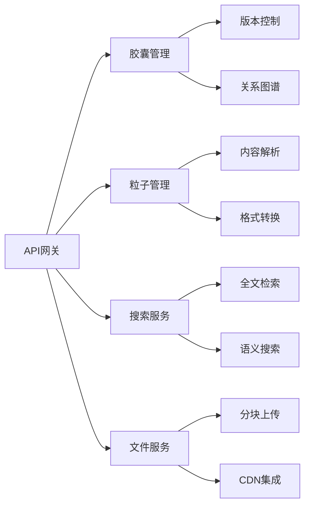

## 设计理念

### 胶囊 Capsule

胶囊是装载一个或多个粒子的容器，是知识的基本单位。胶囊可以是一个事件、一个概念、一个想法、一个项目等等。胶囊的内容可以是一个或多个粒子，也可以是其他小胶囊。 Capsule 是“知识体系”中的基本单位，一个 Capsule 即代表了“一个”知识。

```json
{
    "id": "A-1",
    "tags": ["tag1", "tag2", "tag3"],
    "title": "Atom the first",
    "content": ["Q-1", "Q-2", "Q-3"],
    "last-modified": "2019-01-01T00:00:00Z"
}

```

### 粒子 Particle

Particle 是”知识体系“中的最小单位，是”知识“的组成部分。许多粒子组合在一起，形成了一个胶囊。

一个 Particle 仅能包含**一个**内容（比如一张图片、一段文字、一个视频等）。

注意：对于非文字的内容，应当提供一个“transcript”字段，用于以文字形式描述该内容，以方便检索。

- 类型
- 内容（一句话或者一张图片）
- 知识的基本单位


```json
{
    "id": "Q-1",
    "type": "text",
    "content": "hello, world. this is the first quark created by god!"
}
```
```json
{
    "id": "Q-2",
    "type": "img",
    "content": "C:/xxxx/xxxx.jpg",
    "transcript": "(Including: Text in the image, People in the image, etc. in order to make the image searchable)"
}
```

## 示例

### Capsule示例
#### 《四张机演出》
- 类型：事件
- 关键词：高中、戏剧、中文、学校、清澜山
- 内容：我们演了四张机……（具体描述经过等等）
- 关联：[Proton]剧照 [Proton]演员感言

### Particle示例
#### 个人知识体系
> "我想搭建一个个人知识体系，可以把我毕生所学变成一个很大的collection"

#### Triangle工作室
> 我们一起建一个工作室吧，我们可以一起做项目。Triangle总是最稳的。

## 核心思想
- 万物是有Atom组成的，搜索的本质是下探到Atom？
- Item是由相关的Atom组成在一起的一个collection，由AI生成总结什么的

我觉得数据存储方法反而是其次，重点是如何高效地搜索、整理和组织这些数据，给用户提供更好的体验。我们还需要细细地打磨数据存储方式，尽量使其有更多的扩展性。

## 系统架构设计


## 核心数据模型设计


## 模块分解图
