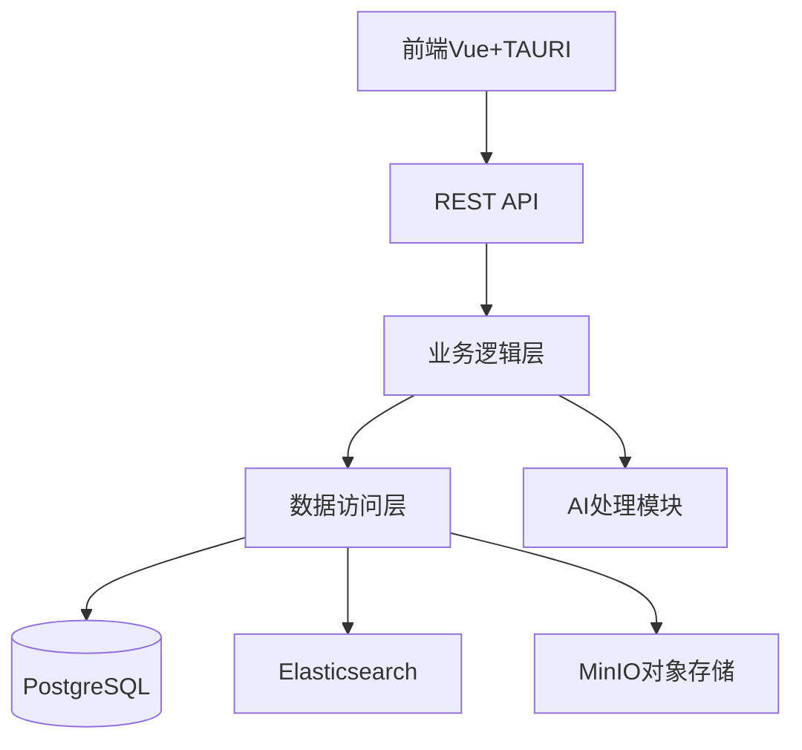
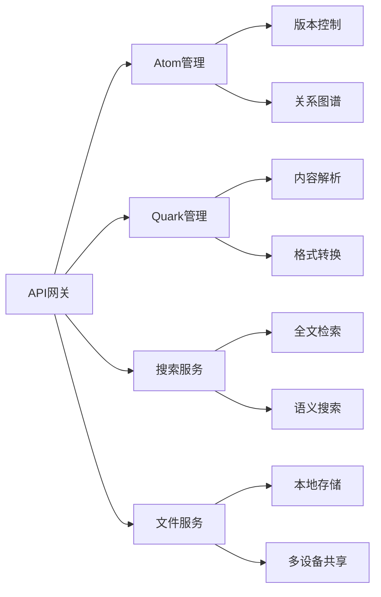

## 系统架构设计

```mermaid
graph TD
    A[前端Vue+TAURI] --> B[REST API]
    B --> C[业务逻辑层]
    C --> D[数据访问层]
    D --> E[(PostgreSQL)]
    D --> F[Elasticsearch]
    D --> G[MinIO对象存储]
    C --> H[AI处理模块]
```

## 模块分解图

```mermaid
graph LR
    A[API网关] --> B[Atom管理]
    A --> C[Quark管理]
    A --> D[搜索服务]
    A --> E[文件服务]
    B --> F[版本控制]
    B --> G[关系图谱]
    C --> H[内容解析]
    C --> I[格式转换]
    D --> J[全文检索]
    D --> K[语义搜索]
    E --> L[本地存储]
    E --> M[多设备共享]
```