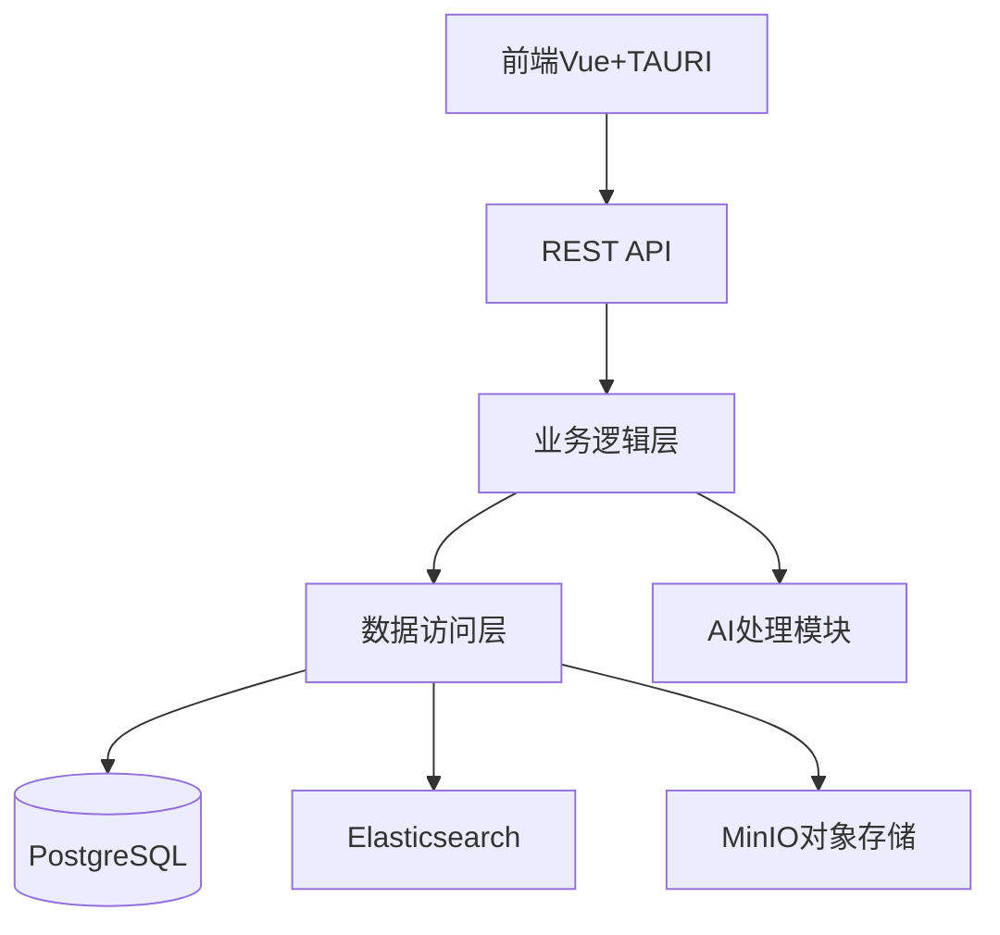
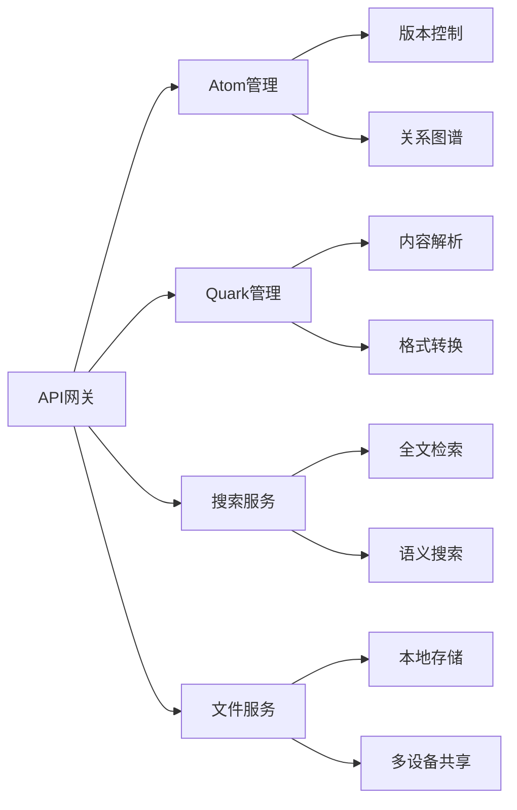

## 系统架构设计

## 模块分解图

## 业务逻辑
1. 原子 Atom
   每当添加一个atom之后，首先对这个atom的内容进行语义分析和关键词切割，并将关键词按照出现的频率在keywords中排序储存
   然后搜索这个Atom可能有关联的其他Atom，并将可能的联系放在队列“suggested connections”中，等待用户进行确认
   当用户确认一个suggested connection之后，将这个connection添加到connections中
   在一段内容中，允许用户按照 [Atom id="0xb772317f7e17aa4690161a642"][/]的方式引用其他Atom
   在一段内容中，允许用户按照 [Quark id="1xf5a5d1d98f0b12ffbc52a9446"][/]的方式引用其他Quark
   当用户引用一个Atom时，将这个Atom的id添加到connections中
   Connection需要有权重，
   用户直接指定的权重为1~1.2，用户可以选择1 1.1 和 1.2 三种权重，分别为有关联，很有关联和强关联的选项
   用户在其他atom中引用的权重为0.5~1，在同一个atom引用三次以上就询问用户是否建立关联，引用次数越多，权重越高

