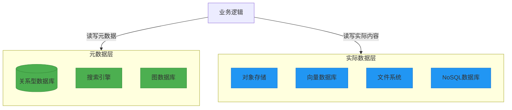

### Atom
Atom 是“知识体系”中的基本单位，一个 Atom 即代表了“一个”知识。

Atom需要记录以下几个内容：
- 标题（title）
- 关键词（tags）
- 内容（content）
- 最后修改时间（last-modified）

其json表示如下：
```json
{
    "id": "A-1",
    "tags": ["tag1", "tag2", "tag3"],
    "title": "Atom the first",
    "content": ["Q-1", "Q-2", "Q-3"],
    "last-modified": "2019-01-01T00:00:00Z"
}
```

### Quark
Quark 是”知识体系“中的最小单位，是”知识“的组成部分。

一个 Quark 仅能包含**一个**内容（比如一张图片、一段文字、一个视频等）。

注意：对于非文字的内容，应当提供一个“transcript”字段，用于以文字形式描述该内容，以方便检索。

两个示例Quark结构如下：
```json
{
    "id": "Q-1",
    "type": "text",
    "content": "hello, world. this is the first quark created by god!"
}
```
```json
{
    "id": "Q-2",
    "type": "img",
    "content": "C:/xxxx/xxxx.jpg",
    "transcript": "(Including: Text in the image, People in the image, etc. in order to make the image searchable)"
}
```

### Connection
TODO
```json
# TODO
```


